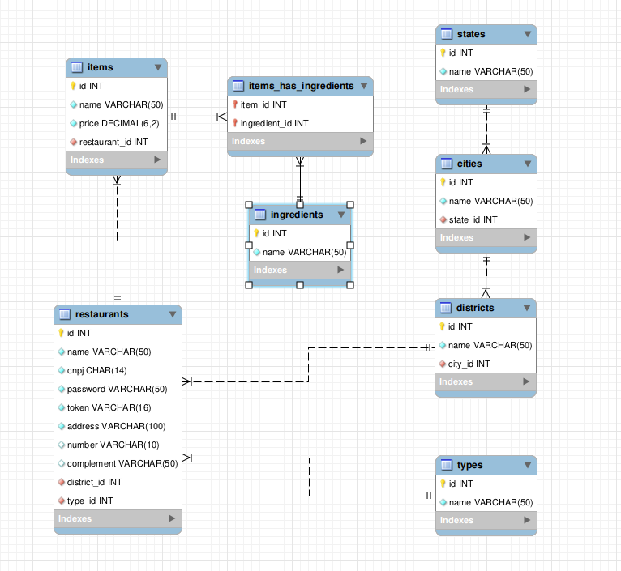

# UaiFood API

Projeto realizado para o desafio prático do processo seletivo da empresa [Evnts](https://evnts.com.br/).

Essa API foi desenvolvida para uma aplicação parecida com o iFood, onde se pode cadastrar restaurantes e itens do seu cardápio.

Projeto desenvolvido com Node.js e Express para criação da API, MySql para criação e manipulação de banco de dados e Docker para containerização. Foi usado a arquitetura MSC para divisão de camadas da aplicação.

## Modelo de entidade e relacionamento do banco de dados



## Como rodar

Na raiz do projeto, basta executar o comando `docker-compose up`. Após esse comando, todos os entrypoints podem ser acessados através da porta `3001` da máquina que executou.


## Endpoints

<details>
  <summary><strong>1 - (POST): /register</strong></summary><br />

  Essa rota serve para registrar um restaurante novo. No `body` da requisição deve-se mandar um `json` no seguinte formato:

```json
{
  "name": "string",
  "cnpj": "string",
  "password": "string",
  "address": "string",
  "number": "string",
  "complement": "string (não obrigatório)",
  "district": "string",
  "city": "string",
  "state": "string",
  "type": "string"
}
```

  Após a validação o restaurante será criado e a seguinte resposta será enviada:

```json
{
	"message": "Restaurante criado com sucesso!",
	"token": "ee04cb8c5a06c0bd"
}
```

  Esse `token` será usado para verificar se o restaurante está cadastrado na hora de criar um item para seu cardápio.

</details><br />

<details>
  <summary><strong>2 - (POST): /item</strong></summary><br />

  Essa rota serve para registrar um item novo para um restaurante. No `body` da requisição deve-se mandar um `json` no seguinte formato:

```json
{
  "name": "string",
  "price": number,
  "token": "string",
  "ingredients": [
    "string1",
    "string2",
    ...,
    "stringN"
  ] 
}
```

  Após a validação o item será criado e a seguinte resposta será enviada:

```json
{
	"message": "Item criado."
}
```

  Se o `token` não for válido, terá um erro com a seguinte resposta:

```json
{
	"message": "Token inválido"
}
```

</details><br />

<details>
  <summary><strong>3 - (PUT): /item</strong></summary><br />

  Essa rota serve para atualizar um item já criado de um restaurante. No `body` da requisição deve-se mandar um `json` no seguinte formato:

```json
{
  "id": number,
  "name": "string",
  "price": number,
  "token": "string",
  "ingredients": [
    "string1",
    "string2",
    ...,
    "stringN"
  ] 
}
```

  Após a validação o item será atualizado e a seguinte resposta será enviada:

```json
{
	"message": "item atualizado."
}
```

  Se o `token` não for válido, terá um erro com a seguinte resposta:

```json
{
	"message": "Token inválido"
}
```

</details><br />

</details>

<details>
  <summary><strong>4 - (GET): /restaurants</strong></summary><br />

  Essa rota serve para listar restaurantes. A requisição retorna um `json` no seguinte formato:

```json
[
	{
		"restaurantId": 1,
		"restaurant": "Fideles",
		"type": "Hamburgueria",
		"city": "Santa Isabel",
		"state": "São paulo"
	},
  ...
]
```

  Esse `endpoint` também pode receber parâmetros de pesquisa através de `query string`. Exemplos:

  - `/restaurants?city=Taubaté`: para filtrar a pesquisa pelo nome da cidade.
  - `/restaurants?state=Pernambuco`: para filtrar a pesquisa pelo nome do estado.
  - `/restaurants?type=Hamburgueria`: para filtrar a pesquisa pelo tipo do restaurante.
  - `/restaurants?dish=Macarrao`: para filtrar a pesquisa pelo prato do restaurante.

  Também é possível usar mais de um parâmetro por vez, exemplo:
  - `/restaurants?type=Japonês&dish=Sushi`: para filtrar a pesquisa pelo tipo do restaurante e seu prato.

</details><br />

## Próximos passos:

- Criar uma rota de login que receba nome do restaurante ou cnpj e sua senha, para receber seu token;

- Desenvolver testes;

- Fazer com que o filtro de prato não filtre somente pelo nome, mas também pelos ingredientes;

- Refatorar código para eliminar algumas repetições, deixá-lo mais limpo e aumentar seu desempenho.